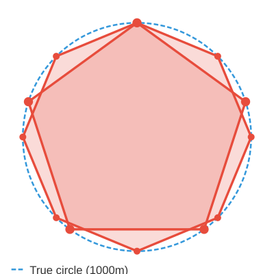
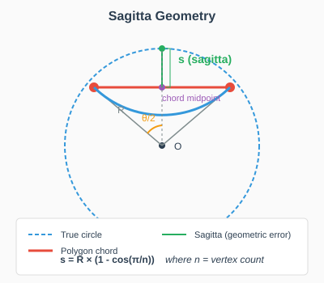
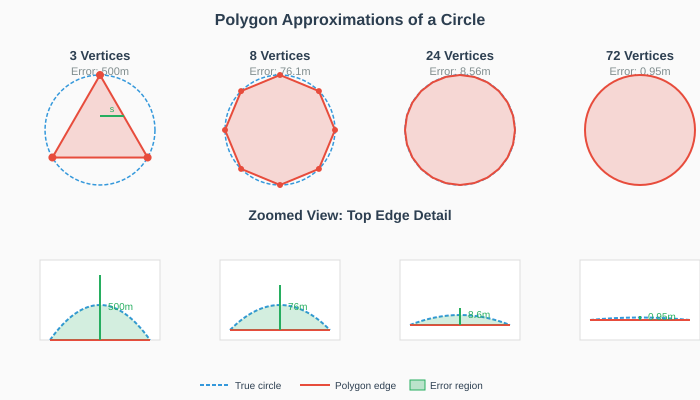
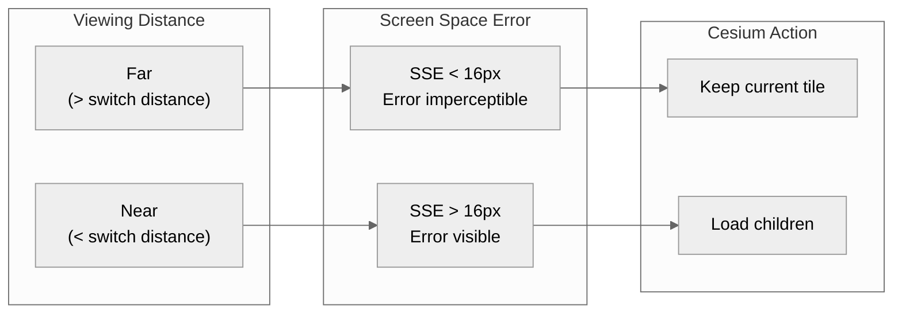
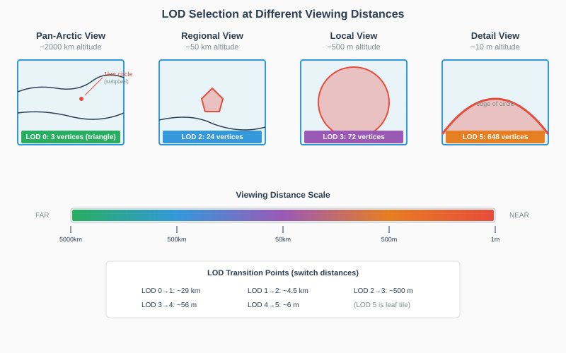
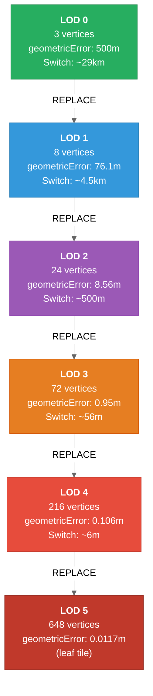
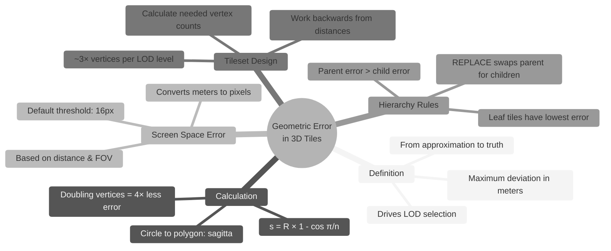
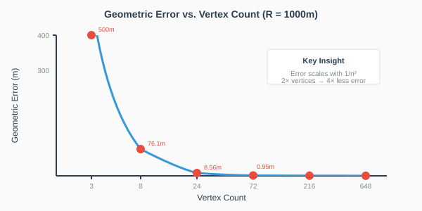

# Understanding Geometric Error in Cesium 3D Tiles

## Introduction

This tutorial explains how geometric error works in Cesium 3D Tiles, using a simple example: a 1 km radius circle represented as a polygon. We'll work through the concepts logically to build an efficient multi-LOD tileset.

---

## The Core Concept

Cesium's 3D Tiles uses **geometric error** to drive level-of-detail (LOD) selection. Geometric error represents the maximum spatial deviation (in meters) between a tile's geometry and the "true" geometry it approximates.

Cesium converts this to **Screen Space Error (SSE)**—an estimate of how many pixels of error would be visible at the current viewing distance. When SSE exceeds a threshold (default: 16 pixels), Cesium loads higher-detail children.

---

## Our Example: A 1 km Circle

The following diagram illustrates this decision flow. Imagine a perfect circle, with a `1 km` radius that is located in Alaska near the Beaufort Coast, with the location as follows:

**Source data:**
- Center: -156.63436782195075° longitude, 71.2290690157726° latitude
- Radius: 1 km
- Representation: polygon with evenly-spaced vertices

This perfect circle can be approximated using a regular, closed polygon with a finite set of vertices. The more vertices in the polygon, the closer to circular the shape wil be. For example, a 5-vertex polygon will have longer stright-line segments and deviate more from the perfect circle than a 8-vertex polygon.



### Bounding Volume

For a 1 km radius circle at latitude 71.229°, the bounding region would be:

```json
"boundingVolume": {
  "region": [
    -2.7351682,  // west
    1.2430851,   // south
    -2.7340898,  // east
    1.2436343,   // north
    0,           // min height
    0            // max height
  ]
}
```

---

## Calculating Geometric Error

When approximating a circle with a polygon, maximum error occurs at the midpoint of each chord. This deviation is called the **sagitta**.



**Formula:**

```python
s = R × (1 - cos(π/n))
```

Where R = radius, n = vertex count.

### Example: 500-vertex polygon

```python
θ = 2π / 500 = 0.01257 radians
s = 1000 × (1 - cos(π/500))
s = 1000 × (1 - 0.99998)
s = 0.0197 meters
```

**Geometric error ≈ 2 cm**

This geometric error represents the maximum distance that the polygon deviates from the ideal circle, which in this case is the sagitta. For our circle example, the sagitta is the same for every segment in the polygon, but in real-world cases where the polygons aren't perfectly symmetrical, the errors will differ for each segment. Cesium treats the geometric error as the worst case scenario for pixel error, so in the case where each segment has a different error, the right approach would be to calculate them all and take the maximum value. This conservative approach enables Cesium to make good decisions about whether loading a child tile is needed at a given camera distance.

---

## Visualizing Polygon Approximations

The following diagram shows how vertex count affects the polygon's fidelity to the true circle:




| Vertices | Visual Appearance | Geometric Error |
|----------|-------------------|-----------------|
| 3 | Triangle | 500 m |
| 8 | Octagon | 76.1 m |
| 24 | Nearly circular | 8.56 m |
| 72 | Smooth circle | 0.95 m |

So, we can see that it doesn't take a lot of vertices to approximate our 1km radius circle with reasonable fidelity.

---

## When Precisely Does Cesium Switch LODs?

The Screen Space Error (SSE) formula is used to determine when the switch from one LOD to another will occur. The SSE is affected both by the geometric error of the tile and the distance that the camera is from the tile (as well as the angle at which the tile is being viewed):

```python
SSE = (geometricError × screenHeight) / (distance × 2 × tan(fov/2))
```

The default SSE for switching LODs in Cesium is 16 pixels, so we can rearrange this formula to calculate the distance at which we will switch from one LOD to it's children for any given tile geometric error. Solving for switch distance (when SSE = 16 pixels):

```python
distance = (geometricError × screenHeight) / (16 × 2 × tan(30°))
distance = geometricError × 58.5  # (for 1080p, 60° FOV)
```

For our 500-vertex polygon, the switch distnace for the camera will be:

```python
distance = 0.0197 × 58.5 = 1.15 meters
```

**Interpretation**: At 1.15m, the 2 cm error spans exactly 16 pixels. Closer than this, the error becomes visually apparent and we switch to viewing children tiles.



---

## Designing a Multi-LOD Hierarchy

For smooth zooming from pan-Arctic (~5000 km) to arm's length (~1 m), we need tiles at various detail levels. In our idealized case, we can make some exact calculations to determine how many levels of detail we need (LODs), what the switch distances would be at those LODs, and the vertex counts that would be ideal at each level of detail.

### Step 1: Determine Required Geometric Errors

Working backwards from desired switch distances:

```python
geometricError = distance / 58.5
```

| Switch Distance | Required Error |
|-----------------|----------------|
| 5000 km | 85,500 m |
| 100 km | 1,710 m |
| 1 km | 17 m |
| 100 m | 1.7 m |
| 10 m | 0.17 m |
| 1 m | 0.017 m |

### Step 2: Calculate Vertex Counts

Rearranging the sagitta formula to solve for the number of vertices:

```python
n = π × √(R / (2 × s))
```

For our circle with radius `R = 1000 m`, we can now calculate how many vertices would be ideal (and usefully apparent) at each viewing distance:

| Geometric Error | Vertices |
|-----------------|----------|
| 85,500 m | 3 (minimum) |
| 1,710 m | 3 (minimum) |
| 76 m | 8 |
| 8.5 m | 24 |
| 0.95 m | 72 |
| 0.106 m | 216 |
| 0.012 m | 648 |

### Key Insight

At pan-Arctic distances, the entire 1 km circle is subpixel:

```txt
At 5000 km: circle spans ~0.4 pixels
```

Coarse LODs represent "something exists here" rather than actual shape. Only at much closer camera distances can the deviations of the polygon from the ideal circle be detected.

---

## LOD Visualization at Different Zoom Levels

The following diagrams demonstrate which LOD would be rendered at various viewing distances:



---

## The Complete Tileset

Given all of this, a practical 6-level hierarchy with ~3× vertex increase per level for our idealized circle would be:

| LOD | Vertices | Geometric Error | Switch Distance |
|-----|----------|-----------------|-----------------|
| 0 | 3 | 500 m | ~29 km |
| 1 | 8 | 76.1 m | ~4.5 km |
| 2 | 24 | 8.56 m | ~500 m |
| 3 | 72 | 0.95 m | ~56 m |
| 4 | 216 | 0.106 m | ~6 m |
| 5 | 648 | 0.0117 m | (leaf) |

### Tile Hierarchy Structure



### Tileset JSON

This is the tileset.json for that hierarchy, showing the gemetric error for each tile and its children.

```json
{
  "asset": {
    "version": "1.1"
  },
  "geometricError": 500,
  "root": {
    "geometricError": 500,
    "boundingVolume": {
      "region": [-2.7351682, 1.2430851, -2.7340898, 1.2436343, 0, 0]
    },
    "refine": "REPLACE",
    "content": {
      "uri": "tiles/lod0_3vertices.b3dm"
    },
    "children": [
      {
        "geometricError": 76.1,
        "boundingVolume": {
          "region": [-2.7351682, 1.2430851, -2.7340898, 1.2436343, 0, 0]
        },
        "refine": "REPLACE",
        "content": {
          "uri": "tiles/lod1_8vertices.b3dm"
        },
        "children": [
          {
            "geometricError": 8.56,
            "boundingVolume": {
              "region": [-2.7351682, 1.2430851, -2.7340898, 1.2436343, 0, 0]
            },
            "refine": "REPLACE",
            "content": {
              "uri": "tiles/lod2_24vertices.b3dm"
            },
            "children": [
              {
                "geometricError": 0.95,
                "boundingVolume": {
                  "region": [-2.7351682, 1.2430851, -2.7340898, 1.2436343, 0, 0]
                },
                "refine": "REPLACE",
                "content": {
                  "uri": "tiles/lod3_72vertices.b3dm"
                },
                "children": [
                  {
                    "geometricError": 0.106,
                    "boundingVolume": {
                      "region": [-2.7351682, 1.2430851, -2.7340898, 1.2436343, 0, 0]
                    },
                    "refine": "REPLACE",
                    "content": {
                      "uri": "tiles/lod4_216vertices.b3dm"
                    },
                    "children": [
                      {
                        "geometricError": 0.0117,
                        "boundingVolume": {
                          "region": [-2.7351682, 1.2430851, -2.7340898, 1.2436343, 0, 0]
                        },
                        "refine": "REPLACE",
                        "content": {
                          "uri": "tiles/lod5_648vertices.b3dm"
                        }
                      }
                    ]
                  }
                ]
              }
            ]
          }
        ]
      }
    ]
  }
}
```

---

## Real-World Tilesets

In real-world tilesets, tiles contain irregularly-shaped polygons, often many per tile, and we typically don't have access to the "true" idealized geometry. The geometric error must still represent the worst-case scenario: the maximum deviation of any line segment from its higher-fidelity representation.

### Calculating Geometric Error Without Known Ideal Geometry

When building a multi-LOD tileset from real data, geometric error is calculated by comparing **successive LOD levels**, not against an unknown ideal:

**Parent-to-child comparison:**
```
geometricError_parent = max_deviation(parent_geometry, child_geometry)
```

For each polygon in the parent tile:
1. **Find the corresponding higher-detail version** in the child tile(s)
2. **Measure the maximum perpendicular distance** from any parent edge to the child geometry
3. **Take the maximum** across all polygons in the tile

**Practical measurement approaches:**

1. **Vertex-to-edge distance**: For each vertex in the child geometry, compute its perpendicular distance to the nearest parent edge. The maximum distance is the error.

2. **Edge sampling**: Sample points along child edges and measure their distance to the parent polygon boundary. Useful for curved features simplified to straight segments.

3. **Hausdorff distance**: Compute the maximum distance from any point on one geometry to the nearest point on the other. This is the most rigorous but computationally expensive.

4. **Simplification-based**: If generating LODs via simplification algorithms (Douglas-Peucker, Visvalingam-Whyatt), the algorithm's tolerance parameter directly gives you the geometric error.

### Multi-Polygon Tiles

For tiles containing multiple polygons:

```
geometricError_tile = max(error_polygon1, error_polygon2, ..., error_polygonN)
```

**Why maximum?** Because Cesium's LOD system needs a conservative guarantee. All geometries in a tile refine together - you can't selectively refine just the high-error polygons. The tile's geometric error must account for the worst-case geometry to ensure acceptable visual quality at any viewing distance.

### Tile Composition Guidelines

**Best practice**: Group polygons with similar geometric errors into the same tile.

**Why it matters:**
- If a tile contains one polygon with 100m error and 50 polygons with 1m error, the tile's geometric error must be 100m
- This forces all 50 low-error polygons to refine at the same (far) distance as the high-error polygon
- Result: unnecessary data loading and reduced performance

**Strategies:**

1. **Spatial clustering with error awareness**: When partitioning data into tiles, consider both spatial proximity and error magnitude. Separate high-error features from low-error features when possible.

2. **Feature-size-based tiling**: Large features (coastlines, rivers) naturally have higher errors at coarse LODs than small features (buildings). Consider separate tile hierarchies for different feature classes.

3. **Error-driven simplification**: When generating parent tiles, simplify all polygons to a similar target error rather than using a uniform vertex reduction ratio.

### Leaf Tile Geometric Error

For the highest-detail (leaf) tiles, where there are no children:

- Set `geometricError` to represent the **inherent precision of your source data**
- Common values: 0.01m to 1m, depending on data source (LiDAR, photogrammetry, survey data)
- This tells Cesium: "refining further won't improve accuracy"
- Too small (e.g., 0.0001m) suggests false precision; too large wastes the last refinement step

---

## Key Takeaways



---

## Quick Reference Formulas

| Purpose | Formula |
|---------|---------|
| Geometric error (circle→polygon) | `s = R × (1 - cos(π/n))` |
| Vertices needed for error | `n = π × √(R / (2×s))` |
| Switch distance | `d = geometricError × 58.5` |
| Error for switch distance | `s = distance / 58.5` |

*Constants assume: 1080p screen, 60° FOV, 16-pixel SSE threshold*

---

## Appendix: Error Scaling Visualization


